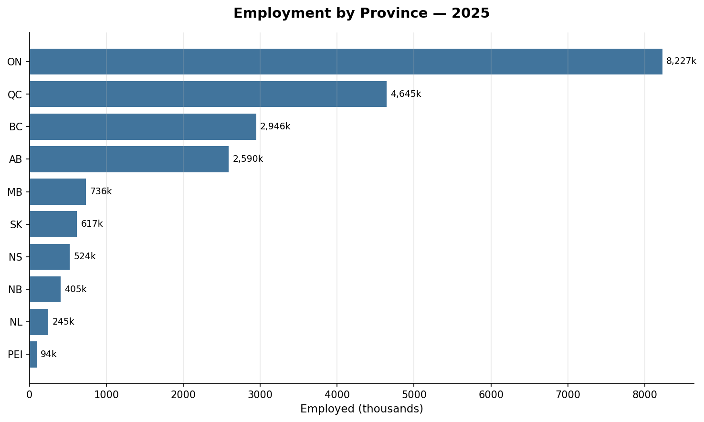
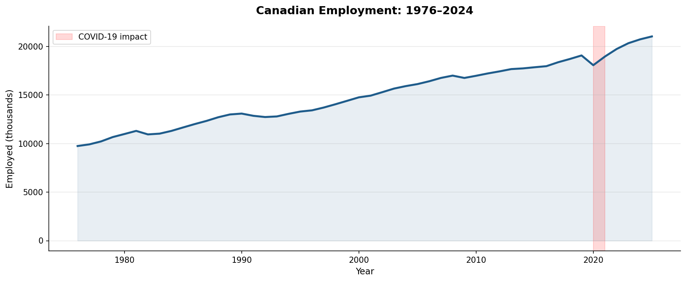
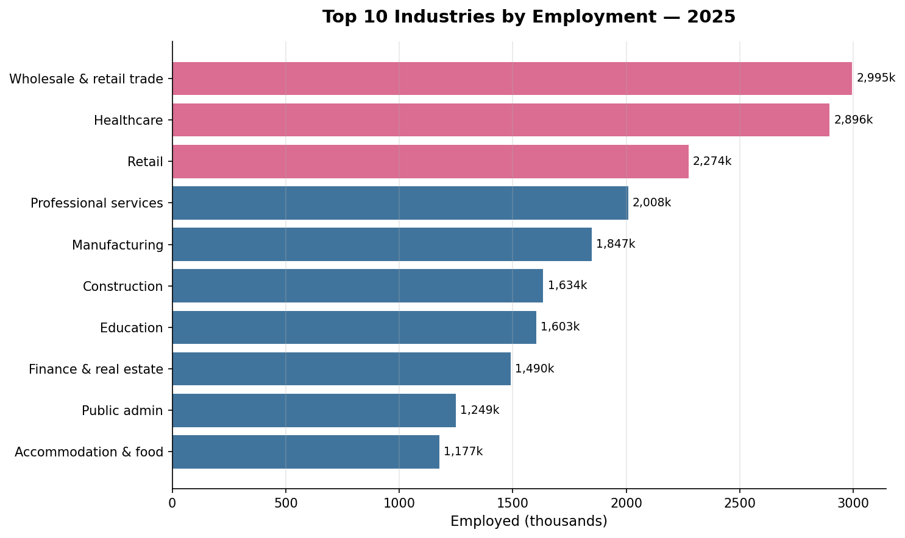
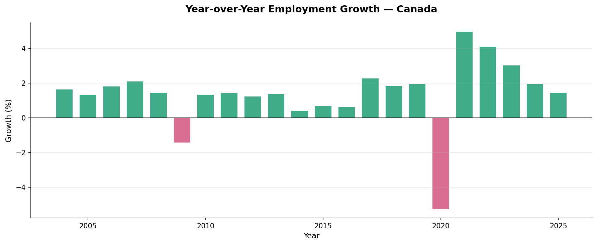

# 🇨🇦 Canadian Labour Market Analysis (1976–2025)


An end-to-end data analysis of the Canadian labour market spanning 50 years of Statistics Canada data. Built to uncover employment trends, sector shifts, and the measurable impact of major economic events including the 2008 financial crisis and COVID-19.

---

## 📊 Interactive Dashboard

🔗 **[View Live Tableau Dashboard →](https://public.tableau.com/app/profile/nunj.patel/viz/CanadianJobsMarketAnalysis-NunjPatel/CanadianJobsMarketAnalysis)**



---

## 🔍 Key Findings

| Metric | Value |
|---|---|
| Total employed (2025) | 21,028,700 |
| COVID-19 employment drop (2020) | -5.3% |
| Recovery growth (2021) | +5.0% |
| Years of data | 1976 – 2025 |
| Provinces covered | 10 |
| Industries tracked | 28 |

**Notable insights:**
- 📈 Canadian employment grew from ~10M (1976) to ~21M (2025) — doubling over 50 years
- 🏥 Healthcare and Wholesale/Retail are the two largest employing sectors in 2025
- 🦠 COVID-19 caused the steepest single-year employment drop in the entire dataset (-5.3%)
- 💪 The 2021 recovery (+5.0%) was the strongest growth year since records began
- 🏙️ Ontario alone accounts for 39% of all Canadian employment (8.2M of 21M)
- 📉 The 2008–09 financial crisis caused a -1.4% drop — far smaller than COVID's impact

---

## 📈 Charts

### National Employment Trend (1976–2025)


### Top 10 Industries by Employment (2025)


### Year-over-Year Growth Rate


---

## 🛠️ Tools & Technologies

| Category | Tools |
|---|---|
| Language | Python 3.8 |
| Data manipulation | Pandas, NumPy |
| Visualization | Matplotlib, Seaborn |
| Dashboard | Tableau Public |
| Data source | Statistics Canada (Open Licence) |

---

## 📁 Project Structure

```
canadian-jobs-analysis/
│
├── data/ 
│   ├── tableau_province.csv              # Cleaned: employment by province/year
│   ├── tableau_industry.csv              # Cleaned: employment by industry/year
│   └── tableau_yoy.csv                   # Cleaned: year-over-year growth
│
├── notebooks/
│   └── 01_eda.ipynb                      # Full analysis notebook
│
├── outputs/
│   └── charts/                           # Exported PNG visualizations
│
└── README.md
```

---

## ▶️ How to Run

```bash
# Clone the repo
git clone https://github.com/Nunjpatel/canadian-jobs-analysis.git
cd canadian-jobs-analysis

# Create virtual environment
python -m venv venv
venv\Scripts\activate        # Windows
source venv/bin/activate     # Mac/Linux

# Install dependencies
pip install pandas numpy matplotlib seaborn jupyter ipykernel

# Launch notebook
jupyter notebook notebooks/01_eda.ipynb
```

**Data sources** (free, no account required):
- [Table 14-10-0023-01](https://www150.statcan.gc.ca/n1/tbl/csv/14100023-eng.zip) — Labour force by industry
- [Table 14-10-0287-01](https://www150.statcan.gc.ca/n1/tbl/csv/14100287-eng.zip) — Labour force by province

---

## 🚀 What I'd Add Next

- Unemployment rate heatmap by province over time
- Gender breakdown analysis — how male vs female employment shifted across sectors
- Forecasting 2026–2030 employment using time-series models (ARIMA/Prophet)
- Immigration data overlay — correlating immigration rates with labour market growth

---

## 👤 Author

**Nunj Patel** · Data Analyst · Toronto, Canada
[LinkedIn](https://www.linkedin.com/in/nunjpatel/) · [GitHub](https://github.com/Nunjpatel) · nunjpatel@gmail.com

---

*Data sourced from Statistics Canada under the [Open Government Licence – Canada](https://open.canada.ca/en/open-government-licence-canada)*
